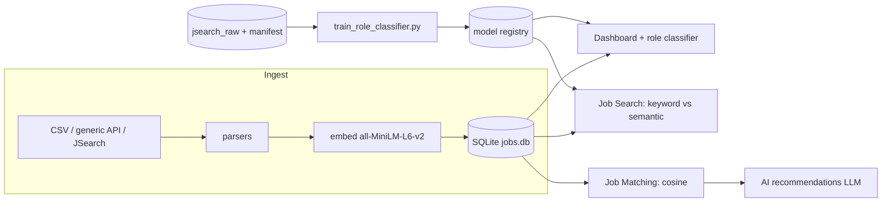
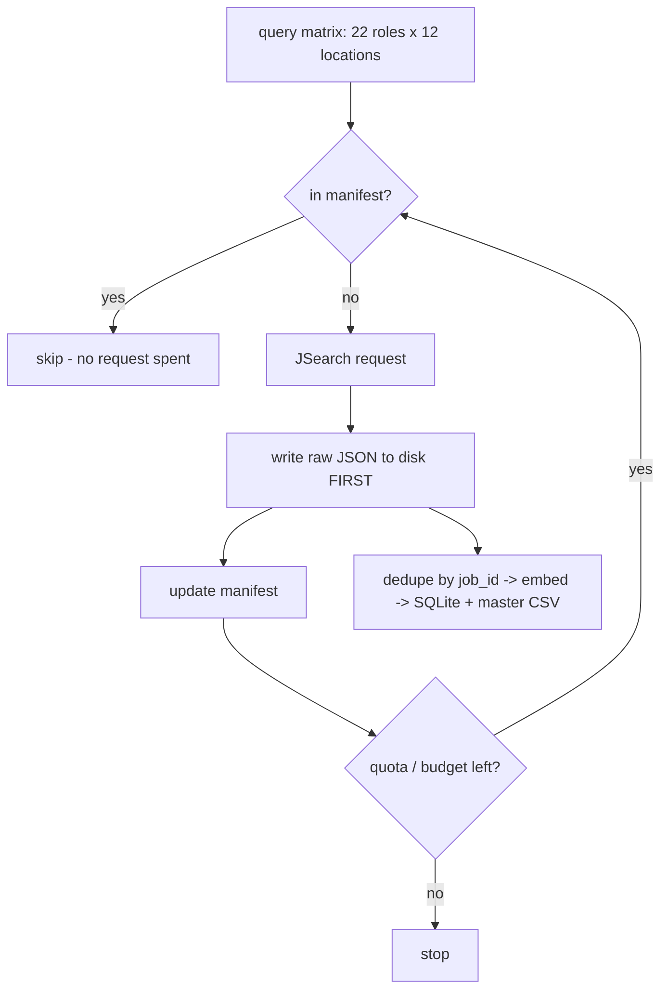
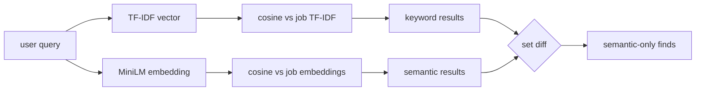
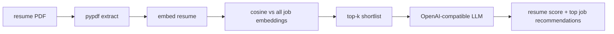
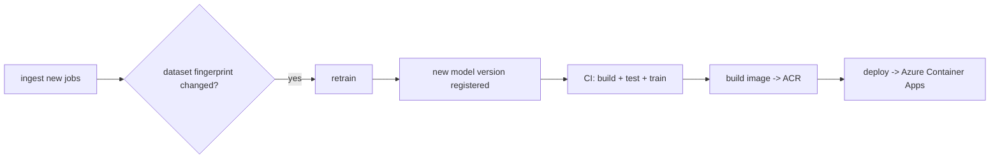
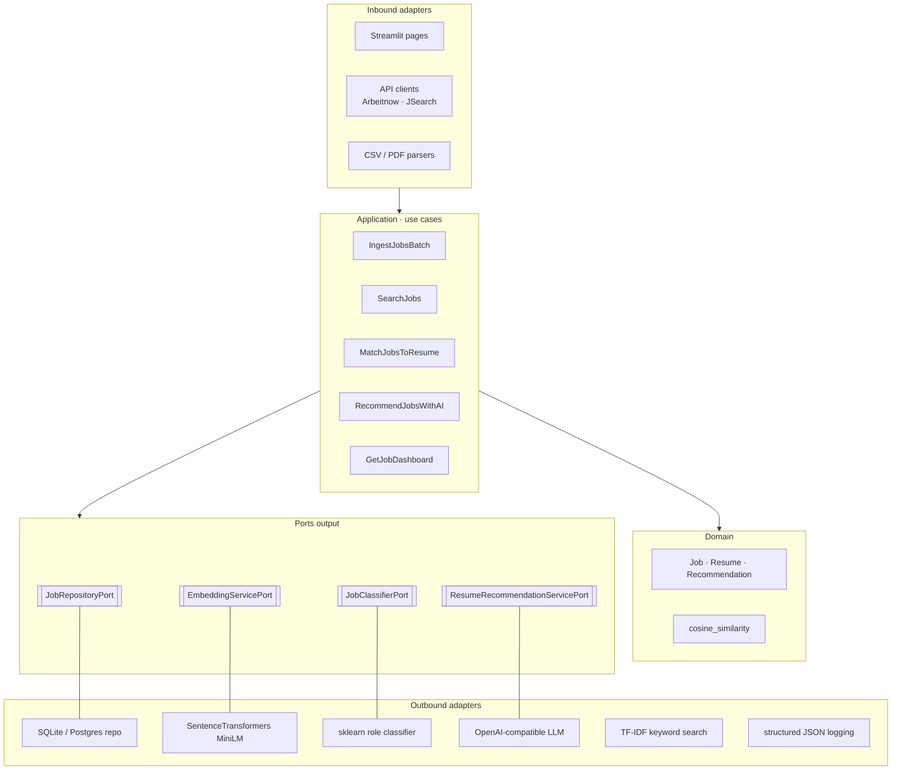
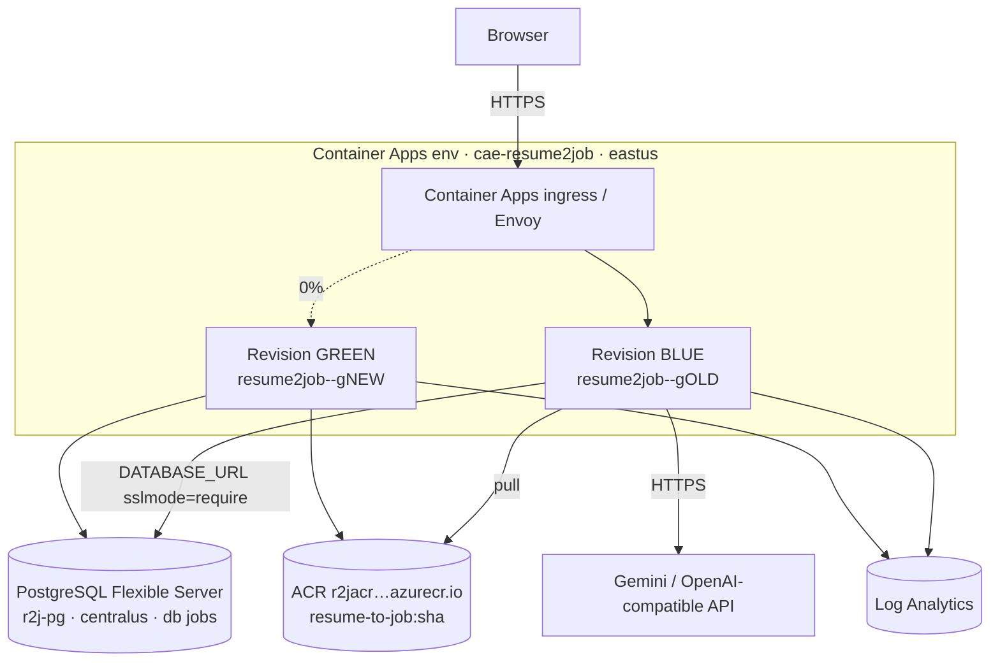

# Diagrams

Mermaid diagrams of the major flows. (GitHub renders Mermaid in Markdown.)

## End-to-end pipeline



## JSearch harvest (budget-safe)



## Keyword vs semantic search



## Resume matching + AI



## MLOps lifecycle



## Hexagonal architecture (ports & adapters)



## Deployment topology (Azure)



## CI/CD pipeline + blue-green release (sequence)

```mermaid
sequenceDiagram
  participant Dev
  participant GH as GitHub Actions
  participant ACR
  participant ACA as Container App
  Dev->>GH: push to main
  GH->>GH: build-test-train (pytest + train_role_classifier.py)
  Note over GH: gate — only if main & ENABLE_DEPLOY=true
  GH->>ACR: docker build & push :sha + :latest
  GH->>ACA: revision set-mode multiple
  GH->>ACA: update --image :sha --revision-suffix gSHA (GREEN @ 0%)
  ACA->>ACR: pull image
  GH->>ACA: poll runningState until Running
  GH->>ACA: GET green-fqdn /_stcore/health
  alt healthy (200)
    GH->>ACA: traffic set GREEN=100 BLUE=0
    Note over ACA: near-zero-downtime swap; BLUE kept warm
  else unhealthy
    GH->>ACA: revision deactivate GREEN
    Note over ACA: BLUE never lost traffic — release aborted
  end
```

## Blue-green state machine

```mermaid
stateDiagram-v2
  [*] --> Blue100: BLUE serves 100%
  Blue100 --> GreenStaged: deploy GREEN @ 0%
  GreenStaged --> HealthCheck: probe GREEN health
  HealthCheck --> Swapped: 200 → GREEN=100, BLUE=0
  HealthCheck --> Aborted: fail → deactivate GREEN
  Aborted --> Blue100
  Swapped --> [*]: GREEN becomes BLUE; old BLUE warm for rollback
```


