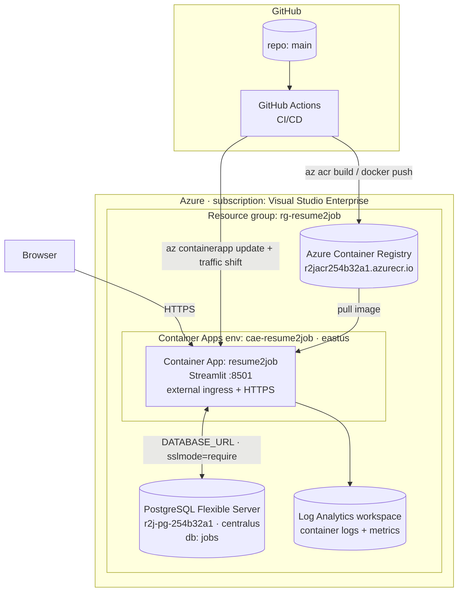

# Azure — Provision, Deploy, Run, Operate

The complete, reproducible Azure guide for **Resume‑to‑Job**. It covers everything from a clean
subscription to a running, continuously‑deployed, blue‑green production app: what each resource is,
the exact `az` commands, the GitHub wiring, and day‑2 operations (logs, scaling, rollback,
teardown).

> Companion docs: [CI/CD](ci-cd.md) · [Blue‑Green deploys](blue-green.md) ·
> [Configuration](configuration.md) · [Deployment map](deployment.md) ·
> [Architecture diagrams](../architecture/diagrams.md)

---

## 1. Topology



**Why this shape:** the Container App filesystem is **ephemeral** — anything written to a local
SQLite file is lost on restart/redeploy. Jobs and their embeddings therefore live in a **shared
PostgreSQL Flexible Server** that both the cloud app and local dev connect to (see
[shared‑DB architecture](../architecture/overview.md) and
[data model](../architecture/data-model.md)). The image is built **in the cloud** (`az acr build`)
because the full `torch`/CUDA dependency tree produces a ~7–8 GB image that is impractical to push
from a laptop or Codespace.

### Reference resource names (this deployment)

| Resource | Name | Region | Notes |
|----------|------|--------|-------|
| Subscription | Visual Studio Enterprise (`254b32a1‑…`) | — | |
| Resource group | `rg-resume2job` | eastus | Logical container for all resources. |
| Container Registry | `r2jacr254b32a1` → `r2jacr254b32a1.azurecr.io` | eastus | Admin‑enabled; image `resume-to-job`. |
| Container Apps env | `cae-resume2job` | eastus | Shared Log Analytics + Envoy ingress. |
| Container App | `resume2job` | eastus | Public URL below. |
| PostgreSQL Flexible Server | `r2j-pg-254b32a1` | **centralus** | DB `jobs`, admin `r2jadmin`, B1ms Burstable. |

Public URL: `https://resume2job.agreeableisland-ffa9d6f6.eastus.azurecontainerapps.io/`

> **⚠️ Region quirk (real, will bite you):** this subscription is region‑restricted
> (“location is restricted”) for **PostgreSQL Flexible Server in `eastus` *and* `eastus2`**.
> `centralus` works. The Container Apps stack itself is fine in `eastus`. Postgres also needs the
> resource provider registered first (next section). Cross‑region app↔DB latency is negligible here
> (single‑digit ms within the US), but keep both in the same region when your subscription allows.

---

## 2. Prerequisites

```bash
# Azure CLI + the Container Apps extension
az version
az extension add --name containerapp --upgrade
az login
az account set --subscription "254b32a1-bd19-4490-a908-d2ed56cd6ab1"

# One-time: register the providers this stack uses (Postgres especially)
az provider register -n Microsoft.App
az provider register -n Microsoft.ContainerRegistry
az provider register -n Microsoft.OperationalInsights
az provider register -n Microsoft.DBforPostgreSQL     # required before Postgres create
```

Set shell variables used throughout:

```bash
RG=rg-resume2job
LOC=eastus
PG_LOC=centralus                 # Postgres region (see quirk above)
ACR=r2jacr254b32a1               # must be globally unique, alphanumeric
ENVN=cae-resume2job
APP=resume2job
IMAGE=resume-to-job
PG=r2j-pg-254b32a1               # Postgres server name (globally unique)
PG_ADMIN=r2jadmin
PG_DB=jobs
```

---

## 3. Provision (one‑time)

### 3.1 Resource group

```bash
az group create -n "$RG" -l "$LOC"
```

### 3.2 Azure Container Registry (ACR)

```bash
az acr create -n "$ACR" -g "$RG" --sku Basic --admin-enabled true

# Capture the admin credentials — these become GitHub SECRETS (section 6).
az acr credential show -n "$ACR" -o table
ACR_LOGIN_SERVER=$(az acr show -n "$ACR" --query loginServer -o tsv)   # r2jacr254b32a1.azurecr.io
```

### 3.3 PostgreSQL Flexible Server (the shared store)

```bash
# Server (Burstable B1ms is plenty for this workload and the cheapest tier).
az postgres flexible-server create \
  -g "$RG" -n "$PG" -l "$PG_LOC" \
  --tier Burstable --sku-name Standard_B1ms \
  --admin-user "$PG_ADMIN" --admin-password '<STRONG_PASSWORD>' \
  --version 16 --storage-size 32 --public-access 0.0.0.0

# Application database
az postgres flexible-server db create -g "$RG" -s "$PG" -d "$PG_DB"

# Firewall: allow Azure services (the Container App) + your dev IP for migrations
az postgres flexible-server firewall-rule create -g "$RG" -n "$PG" \
  --rule-name AllowAzureServices --start-ip-address 0.0.0.0 --end-ip-address 0.0.0.0
az postgres flexible-server firewall-rule create -g "$RG" -n "$PG" \
  --rule-name DevMachine --start-ip-address <YOUR_IP> --end-ip-address <YOUR_IP>
```

Build the connection string the app expects (psycopg, TLS required):

```bash
DATABASE_URL="postgresql://${PG_ADMIN}:<PASSWORD>@${PG}.postgres.database.azure.com:5432/${PG_DB}?sslmode=require"
```

> `sslmode=require` is appended automatically by
> `repository_factory.py` if you omit it — Azure rejects non‑TLS connections.

### 3.4 Container Apps environment

```bash
az containerapp env create -n "$ENVN" -g "$RG" -l "$LOC"
```

This provisions the managed environment (Envoy ingress, Dapr, and a Log Analytics workspace for
logs/metrics).

### 3.5 Build the image in the cloud, then create the app

```bash
# Cloud build avoids pushing a ~7-8GB image from a laptop/Codespace.
az acr build -r "$ACR" -t "${IMAGE}:latest" -t "${IMAGE}:bootstrap" .

# Create the Container App pointing at that image.
az containerapp create -n "$APP" -g "$RG" \
  --environment "$ENVN" \
  --image "${ACR_LOGIN_SERVER}/${IMAGE}:latest" \
  --target-port 8501 --ingress external \
  --registry-server "$ACR_LOGIN_SERVER" \
  --min-replicas 1 --max-replicas 3 \
  --cpu 1.0 --memory 2.0Gi

# Store the DB connection string as a SECRET, then expose it as an env var.
az containerapp secret set -n "$APP" -g "$RG" \
  --secrets "databaseurl=${DATABASE_URL}"
az containerapp update -n "$APP" -g "$RG" \
  --set-env-vars "DATABASE_URL=secretref:databaseurl" "APP_VERSION=2.0"

# (Optional) the LLM key for AI recommendations, same pattern:
az containerapp secret set -n "$APP" -g "$RG" --secrets "aikey=<GEMINI_KEY>"
az containerapp update -n "$APP" -g "$RG" \
  --set-env-vars "AI_API_KEY=secretref:aikey" \
  "AI_API_BASE=https://generativelanguage.googleapis.com/v1beta/openai" \
  "AI_MODEL=gemini-2.5-flash"
```

Print the live URL:

```bash
az containerapp show -n "$APP" -g "$RG" --query properties.configuration.ingress.fqdn -o tsv
```

### 3.6 Seed the shared database (one‑time)

If you already harvested jobs locally into SQLite, migrate them into Postgres (idempotent upsert):

```bash
DATABASE_URL="$DATABASE_URL" JOB_DB_PATH=data/jobs.db \
  python testing/scripts/migrate_sqlite_to_postgres.py
```

Otherwise just use the **Data Ingestion** page in the running app — it writes straight to Postgres.

---

## 4. Service principal for GitHub Actions

CI deploys with a service principal scoped to the resource group. Its JSON becomes the
`AZURE_CREDENTIALS` secret.

```bash
SUB=$(az account show --query id -o tsv)
az ad sp create-for-rbac \
  --name "sp-resume2job-gha" \
  --role contributor \
  --scopes "/subscriptions/${SUB}/resourceGroups/${RG}" \
  --sdk-auth
# Copy the entire JSON object it prints -> GitHub secret AZURE_CREDENTIALS
```

> **Least privilege option:** scope `--role AcrPush` on the registry and a custom role limited to
> `Microsoft.App/containerApps/*` instead of broad `contributor`. Contributor on the RG is the
> simplest for a student/team project.

---

## 5. The continuous‑deployment flow

Once provisioned, **you never run the deploy commands by hand again** — a push to `main` does it:

```mermaid
sequenceDiagram
  participant Dev
  participant GH as GitHub Actions
  participant ACR
  participant ACA as Container App
  Dev->>GH: git push origin main
  GH->>GH: build-test-train (pytest + retrain model)
  GH->>ACR: docker build & push :sha + :latest
  GH->>ACA: revision set-mode multiple
  GH->>ACA: update --image :sha --revision-suffix gSHA  (GREEN @ 0%)
  ACA->>ACR: pull image
  GH->>ACA: health-check GREEN FQDN /_stcore/health
  GH->>ACA: ingress traffic set GREEN=100 BLUE=0
  Note over ACA: near-zero-downtime swap; BLUE kept warm
```

Gating: the `docker` and `deploy` jobs run **only** on `main`/manual dispatch **and** when the repo
variable `ENABLE_DEPLOY == 'true'`. See [CI/CD](ci-cd.md) and [Blue‑Green](blue-green.md).

---

## 6. GitHub configuration — Variables vs Secrets (get this right)

The workflow reads some values as **Variables** (`vars.*`) and some as **Secrets** (`secrets.*`).
They live on **different tabs** in *Settings → Secrets and variables → Actions*. Putting a value on
the wrong tab is the #1 cause of a deploy that silently does nothing or fails at login.

| Put it under… | Name | Workflow reference | Example / source |
|---------------|------|--------------------|------------------|
| **Variables** | `ENABLE_DEPLOY` | `vars.ENABLE_DEPLOY` | `true` |
| **Variables** | `AZURE_ACR_LOGIN_SERVER` | `vars.AZURE_ACR_LOGIN_SERVER` | `r2jacr254b32a1.azurecr.io` |
| **Variables** | `AZURE_RESOURCE_GROUP` | `vars.AZURE_RESOURCE_GROUP` | `rg-resume2job` |
| **Variables** | `AZURE_CONTAINERAPP_NAME` | `vars.AZURE_CONTAINERAPP_NAME` | `resume2job` |
| **Secrets** | `AZURE_CREDENTIALS` | `secrets.AZURE_CREDENTIALS` | `az ad sp create-for-rbac --sdk-auth` JSON |
| **Secrets** | `AZURE_ACR_USERNAME` | `secrets.AZURE_ACR_USERNAME` | `az acr credential show` username |
| **Secrets** | `AZURE_ACR_PASSWORD` | `secrets.AZURE_ACR_PASSWORD` | `az acr credential show` password |

> **Self‑check:** the four non‑sensitive names go under **Variables**; the three credentials go
> under **Secrets**. If you added `AZURE_ACR_PASSWORD` or `AZURE_CREDENTIALS` as a *Variable*, the
> deploy job won’t authenticate. Move them to the Secrets tab.

> **Note on tooling:** a Codespaces/Actions `GITHUB_TOKEN` **cannot** create Actions secrets/variables
> (HTTP 403) and cannot trigger `workflow_dispatch`. Set them via the GitHub UI or a PAT with `repo`
> scope. A push to `main` is the reliable way to trigger a deploy run.

---

## 7. Day‑2 operations

### Logs
```bash
# Live tail of the app's stdout/stderr (structured JSON logs)
az containerapp logs show -n "$APP" -g "$RG" --follow --tail 100

# System/platform events (scaling, image pulls, probe failures)
az containerapp logs show -n "$APP" -g "$RG" --type system --follow
```

### Status, revisions, replicas
```bash
az containerapp show -n "$APP" -g "$RG" -o table
az containerapp revision list -n "$APP" -g "$RG" -o table
az containerapp replica list -n "$APP" -g "$RG" -o table
```

### Scaling
```bash
# Replica bounds (Container Apps scales to zero only if min=0).
az containerapp update -n "$APP" -g "$RG" --min-replicas 1 --max-replicas 5

# HTTP concurrency scale rule (e.g. add a replica per 50 concurrent requests)
az containerapp update -n "$APP" -g "$RG" \
  --scale-rule-name http-concurrency \
  --scale-rule-type http \
  --scale-rule-http-concurrency 50
```
> Streamlit holds per‑session server state. Keep `min-replicas ≥ 1` and prefer vertical scale
> (CPU/memory) over many small replicas unless you add sticky sessions.

### Restart / roll a revision
```bash
# Restart the active revision (e.g. to re-read a changed secret)
REV=$(az containerapp revision list -n "$APP" -g "$RG" --query "[?properties.active].name | [0]" -o tsv)
az containerapp revision restart -n "$APP" -g "$RG" --revision "$REV"
```

### Update a secret/env var
```bash
az containerapp secret set -n "$APP" -g "$RG" --secrets "databaseurl=<NEW_DSN>"
# Secrets are re-read on the next revision; trigger one:
az containerapp update -n "$APP" -g "$RG" --set-env-vars "DATABASE_URL=secretref:databaseurl"
```

### Connect to Postgres
```bash
az postgres flexible-server connect -n "$PG" -u "$PG_ADMIN" -d "$PG_DB" --interactive
# or any psql client with the DATABASE_URL
```

---

## 8. Rollback

Because blue‑green keeps the previous revision warm, rollback is a traffic shift (seconds, no
rebuild):

```bash
az containerapp revision list -n "$APP" -g "$RG" -o table         # find the previous good revision
az containerapp ingress traffic set -n "$APP" -g "$RG" \
  --revision-weight <previous-revision>=100 <current-revision>=0
```

Model rollback is independent: edit `models/job_role_classifier/registry.json` `latest` to a prior
version and redeploy (see [MLOps lifecycle](../mlops/lifecycle.md)). Full detail in
[Blue‑Green](blue-green.md).

---

## 9. Cost (rough, this configuration)

| Resource | Tier | Idle cost driver |
|----------|------|------------------|
| Container App | 1 vCPU / 2 GiB, min 1 replica | Always‑on replica (no scale‑to‑zero) is the main cost. |
| PostgreSQL Flexible Server | B1ms Burstable, 32 GB | Cheapest managed Postgres tier. |
| Container Registry | Basic | Storage of image layers. |
| Log Analytics | Pay‑as‑you‑go ingest | Usually pennies at this log volume. |

To minimise cost between demos: set `--min-replicas 0` (cold start on first request) and **stop**
the Postgres server (`az postgres flexible-server stop -g "$RG" -n "$PG"`).

---

## 10. Teardown

```bash
# Stop billing without deleting (state preserved):
az postgres flexible-server stop -g "$RG" -n "$PG"
az containerapp update -n "$APP" -g "$RG" --min-replicas 0

# Or remove everything in one shot:
az group delete -n "$RG" --yes --no-wait
```

---

## 11. Troubleshooting

| Symptom | Likely cause | Fix |
|---------|--------------|-----|
| Deploy job skipped (0s) | `ENABLE_DEPLOY` not `true`, or set as a Secret not a Variable | Set `ENABLE_DEPLOY=true` on the **Variables** tab. |
| `az login` fails in CI | `AZURE_CREDENTIALS` malformed / on wrong tab | Re‑run `create-for-rbac --sdk-auth`; paste full JSON into the **Secret**. |
| ACR `docker login` denied | ACR creds on Variables tab, or admin disabled | Move to **Secrets**; `az acr update -n $ACR --admin-enabled true`. |
| Postgres create: “location is restricted” | Subscription region cap | Use `centralus` (not eastus/eastus2); `az provider register -n Microsoft.DBforPostgreSQL`. |
| App boots but shows 0 jobs after restart | Writing to ephemeral SQLite instead of Postgres | Ensure `DATABASE_URL` env var is set on the app. |
| Green never reaches Running | Image pull / port mismatch / crash | `az containerapp logs show --type system`; confirm `--target-port 8501`. |
| Image push times out from laptop | ~7–8 GB torch image | Build in the cloud: `az acr build -r $ACR -t $IMAGE:tag .`. |
