# Blue‑Green Deployments (near‑zero downtime)

Resume‑to‑Job releases with a **blue‑green** strategy on Azure Container Apps so users never hit a
cold or half‑started container during a deploy. This page explains the model, the exact mechanics in
our [CI/CD workflow](../../.github/workflows/ci-cd.yml), and how to operate it by hand.

---

## 1. The idea

| Term | Meaning here |
|------|--------------|
| **Blue** | The revision currently serving 100% of user traffic. |
| **Green** | The new revision (new image) we just rolled out, receiving **0%** traffic until proven healthy. |
| **Swap** | Shifting ingress traffic from blue → green once green passes a health check. |
| **Rollback** | Shifting traffic back to blue (still warm) — seconds, no rebuild. |

Container Apps makes this native through **revisions** and **ingress traffic weights**: in
*multiple‑revision mode* several immutable revisions can coexist, and an Envoy‑based ingress splits
traffic between them by weight. Blue‑green is just “two revisions, weight 100/0, flipped after a
probe.”

```mermaid
stateDiagram-v2
  [*] --> Blue100: steady state (BLUE=100%)
  Blue100 --> GreenStaged: deploy new image as GREEN @0%
  GreenStaged --> HealthCheck: probe GREEN FQDN /_stcore/health
  HealthCheck --> Swapped: 200 OK → traffic GREEN=100, BLUE=0
  HealthCheck --> Aborted: not healthy → deactivate GREEN
  Aborted --> Blue100: BLUE never lost traffic
  Swapped --> [*]: GREEN is the new BLUE; old BLUE kept warm for rollback
```



---

## 2. How the pipeline does it

The `deploy` job in [.github/workflows/ci-cd.yml](../../.github/workflows/ci-cd.yml) runs these
steps (all via `az`):

1. **Multiple‑revision mode** — `az containerapp revision set-mode --mode multiple` so a new
   revision does not automatically take traffic.
2. **Identify BLUE** — read the revision currently weighted > 0 from
   `az containerapp ingress traffic show`.
3. **Roll out GREEN** — `az containerapp update --image <acr>/resume-to-job:<sha>
   --revision-suffix g<sha7>`. The suffix gives a deterministic, traceable revision name
   (`resume2job--g<sha7>`). In multiple mode it starts at **0% traffic**.
4. **Wait for Running** — poll `revision show … runningState` until `Running`.
5. **Smoke‑test GREEN privately** — every revision gets its **own FQDN**; we `curl`
   `https://<green-fqdn>/_stcore/health` (Streamlit’s health endpoint) **before** any user sees it.
6. **Swap** — `az containerapp ingress traffic set --revision-weight "<green>=100" "<blue>=0"`.
7. **Abort path** — if GREEN never returns `200`, we `revision deactivate` GREEN and exit non‑zero.
   BLUE never lost traffic, so the failed release is invisible to users.
8. **Keep BLUE warm** — BLUE stays deployed at 0% for instant rollback.

Why a per‑revision health check matters: the cut to 100% only happens **after** the new container
has loaded the embedding model and the classifier and answered a real HTTP probe — eliminating the
“deploy succeeded but the app is still warming up” window.

---

## 3. Operate it by hand

Useful when demoing, or doing a controlled/canary rollout.

```bash
APP=resume2job ; RG=rg-resume2job ; ACR=r2jacr254b32a1.azurecr.io ; IMG=resume-to-job

# Ensure multiple-revision mode
az containerapp revision set-mode -n $APP -g $RG --mode multiple

# Roll out green at 0% traffic
az containerapp update -n $APP -g $RG --image $ACR/$IMG:<sha> --revision-suffix gmanual1

# List revisions and their weights
az containerapp ingress traffic show -n $APP -g $RG -o table
az containerapp revision list -n $APP -g $RG -o table

# Canary: send 10% to green, keep 90% on blue
az containerapp ingress traffic set -n $APP -g $RG \
  --revision-weight resume2job--gmanual1=10 <blue-rev>=90

# Promote: 100% to green
az containerapp ingress traffic set -n $APP -g $RG \
  --revision-weight resume2job--gmanual1=100 <blue-rev>=0
```

### Rollback

```bash
# Flip traffic straight back to the previous (still-warm) revision
az containerapp ingress traffic set -n $APP -g $RG \
  --revision-weight <previous-rev>=100 <current-rev>=0
```

### Clean up old revisions

```bash
# Keep the last good one for rollback; deactivate the rest
az containerapp revision deactivate -n $APP -g $RG --revision <old-rev>
```

---

## 4. Canary / progressive delivery (extension)

The same primitive supports weighted canaries: instead of `100/0`, set `90/10`, watch logs/metrics,
then ramp `50/50` → `0/100`. A natural next step is to gate the ramp on an error‑rate query against
Log Analytics, or to use Container Apps **labels** (`--label-weight green=100`) for stable,
human‑readable traffic targets.

---

## 5. Limitations & notes

- **Shared database:** blue and green talk to the **same** PostgreSQL server, so a release that
  changes the schema must be **backward compatible** (expand‑then‑contract migrations) for the
  blue‑green overlap window. The current schema is stable (`jobs` table), so this isn’t a concern
  today — but it’s the one rule to keep if the schema evolves.
- **Streamlit sessions:** the swap is per‑request; in‑flight WebSocket sessions on blue continue
  until the user reloads. That’s acceptable for this app (no long‑lived transactions).
- **Cost:** during the overlap both revisions run. With `min-replicas 1` that’s briefly 2 replicas;
  negligible for short swaps.
- **Single‑revision fallback:** to disable blue‑green, set `--mode single`; then
  `az containerapp update --image …` does an in‑place rolling replace instead.
