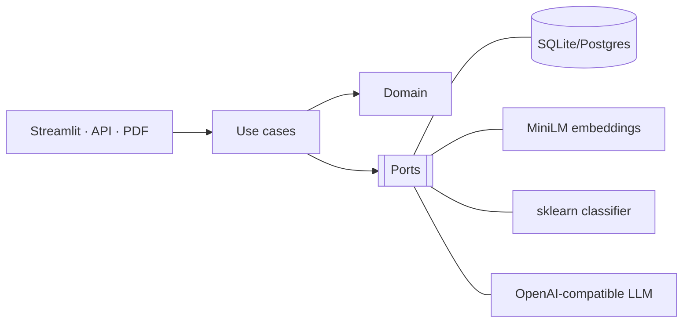
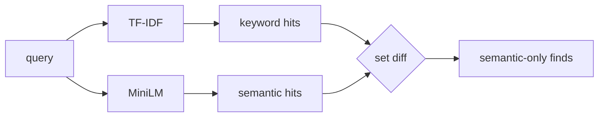
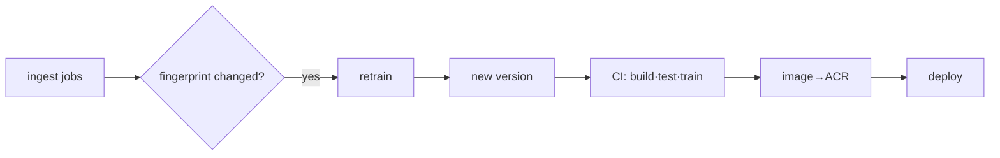
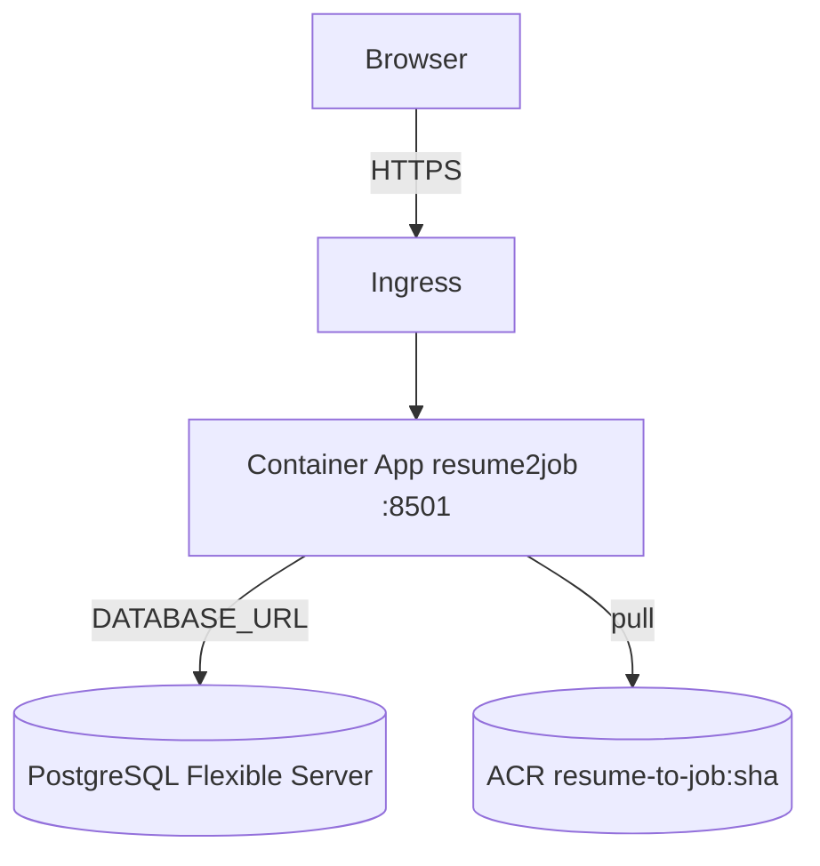
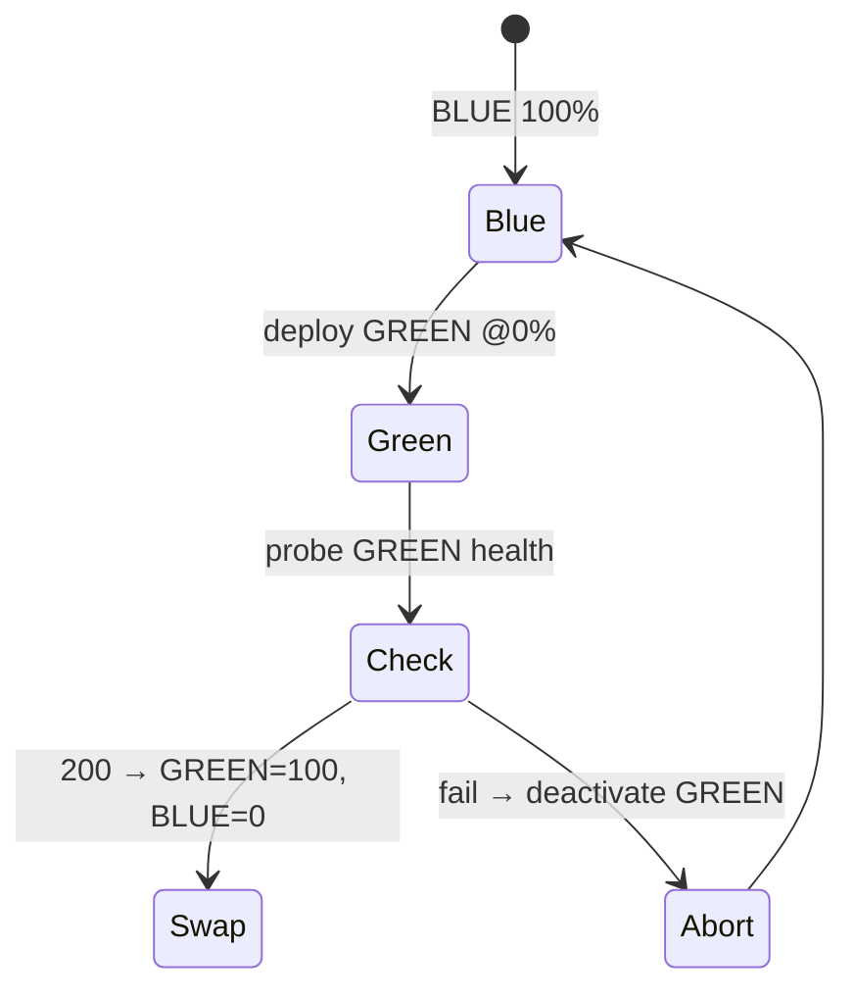

<!--
Presentation deck for AI 510 TP03, Team 3.
Render with Marp (VS Code "Marp for VS Code" extension, or `marp slides.md --pdf`).
Each "---" is a new slide. Speaker notes are in HTML comments.
-->

# Resume‑to‑Job
## An MLOps Job‑Search Platform on Azure

**AI 510 — Artificial Intelligence in Cloud Computing · TP03 · Team 3**
Ruojie · Akzhol · Duy · Quan · Enkhamgalan

`resume2job.…eastus.azurecontainerapps.io`

<!-- 30s: We built a deployed cloud service, not a notebook. Owned model + CI/CD + blue-green. -->

---

## The problem

- Job seekers drown in **high‑volume, noisily‑labeled** feeds.
- Two costs: **finding** relevant postings, and **judging fit** to a resume.
- Course goal: an AI system that is **deployed, operable, and continuously improvable** — real MLOps.

---

## What we built

1. **Ingest** IT jobs (CSV · generic API · JSearch) → embed → shared DB
2. **Classify** every job by role with an **owned, retrainable** model
3. **Search**: keyword (TF‑IDF) **vs** semantic (embeddings), side‑by‑side
4. **Match**: resume PDF → cosine ranking → **AI recommendations**
5. **Model Ops**: registry, metrics, **retrain** → new version
6. **Ship**: build → test → train → **blue‑green deploy** to Azure

---

## Architecture — hexagonal (ports & adapters)

**Payoff:** swapped **SQLite → PostgreSQL** with *zero* changes to domain/use‑case code — one
`repository_factory` reading `DATABASE_URL`.

---

## The dataset — labels for free

- **1,129** unique IT jobs from JSearch (dedup by `job_id`)
- **Weak supervision:** each job labeled by the **role query that surfaced it** (manifest majority vote)
- **11 categories**, a `data_fingerprint` for drift detection
- **Budget‑safe harvest:** checks manifest before each request → re‑runs spend **0** quota

<!-- The clever bit: a search log becomes a labeled dataset at zero annotation cost. -->

---

## The model

`TfidfVectorizer(1–2g)` → `LogisticRegression(C=2.0, balanced)`

| Metric | Value |
|--------|-------|
| Accuracy | **0.889** |
| Macro‑F1 | **0.877** |
| Weighted‑F1 | 0.889 |
| CV macro‑F1 (5‑fold) | **0.836 ± 0.023** |

**Interpretable · CPU‑only · seconds to train · tiny to ship** → ideal for retrain‑in‑CI.

---

## Where it wins and struggles

| Best F1 | Hardest F1 |
|---------|-----------|
| IT Infra & Support **0.97** | Backend **0.78** |
| Cybersecurity **0.97** | ML / AI **0.83** |
| QA & Testing 0.91 | Cloud & DevOps 0.84 |

- **Distinct vocab** → easy (SOC/SIEM, help‑desk).
- **Shared vocab** with neighbours → hard (Backend↔Full‑Stack↔SWE).
- `balanced` weighting favours **recall on small classes** — right for a *tagging aid*.

---

## Keyword vs semantic retrieval

- **Semantic** recovers paraphrase/synonymy (intent without shared tokens).
- **Keyword** wins on exact terms/acronyms.
- We show **both** — a teaching artifact about embeddings.

---

## MLOps loop — data change *is* the build trigger

- CI **re‑produces the model from data** (`pytest` + train) → baked into the image
- Container serves the **exact** model CI validated — no notebook‑vs‑prod gap

---

## Cloud — Azure Container Apps + Postgres

- Container FS is **ephemeral** → state must live in **shared Postgres**
- Image **built in the cloud** (`az acr build`) — the torch image is ~7–8 GB
- Region quirk: Postgres in **centralus** (eastus/eastus2 restricted on this subscription)

---

## Blue‑green = near‑zero downtime

1. New image = **GREEN at 0%** → 2. **health‑check privately** → 3. **swap traffic** only if `200`
→ 4. keep BLUE warm → **rollback in seconds**.

---

## Operational findings (the gotchas)

- **Variables vs Secrets** split is load‑bearing — misplace one and deploy silently no‑ops.
- `GITHUB_TOKEN` can’t write Actions secrets or trigger dispatch (403) → push to `main`.
- **Backward‑compatible schema** required while blue+green share one DB.
- Observability: **structured JSON logs** + `az containerapp logs --follow`.

---

## Limitations & future work

**Limits:** weak labels · lexical model · single US IT harvest · no promotion gate yet.

**Next:**
- CI **promotion gate** on held‑out F1 (champion/challenger)
- **Embedding‑based** classifier (Backend/ML‑AI lift)
- **pgvector** in‑DB search · **MLflow** tracking · **canary** automation · **managed identity**

---

## Conclusion

- A **working, observable, continuously‑deployed** cloud service — not a notebook.
- Owned model: **0.889 acc / 0.877 macro‑F1**, interpretable & cheap to retrain.
- **Closed MLOps loop**: data → retrain → CI → **blue‑green** → Azure, with instant rollback.
- Ports‑and‑adapters let us change the **hardest** decision (persistence) without touching logic.

### Thank you — questions?

`docs/report/findings.md` · `docs/operations/azure.md` · `docs/operations/blue-green.md`
